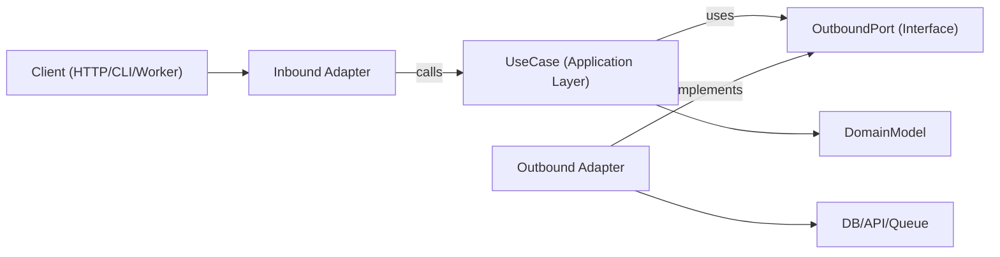

# Hexagonal Architecture

Hexagonal architecture (Ports and Adapters) keeps business logic independent from frameworks, transport, and persistence details. The core app depends on abstract ports, and adapters implement those ports at the edges.

## When to Use

- Building new features where long-term maintainability and testability matter.
- Refactoring layered or framework-heavy code where domain logic is mixed with I/O concerns.
- Supporting multiple interfaces for the same use case (HTTP, CLI, queue workers, cron jobs).
- Replacing infrastructure (database, external APIs, message bus) without rewriting business rules.

Use this skill when the request involves boundaries, domain-centric design, refactoring tightly coupled services, or decoupling application logic from specific libraries.

## Core Concepts

- **Domain model**: Business rules and entities/value objects. No framework imports. In Balance, shared invariants live in `libs/domain`; wire types in `libs/contracts`.
- **Use cases (application layer)**: Orchestrate domain behavior and workflow steps.
- **Inbound ports**: Contracts describing what the application can do (commands/queries/use-case interfaces). Prefer `interface I*` (e.g. `ICreateOrderUseCase`) plus a Nest `Symbol` token.
- **Outbound ports**: Contracts for dependencies the application needs (repositories, gateways, event publishers, clock, UUID, etc.). Prefer `interface I*` + `Symbol` token.
- **Adapters**: Infrastructure and delivery implementations of ports (HTTP controllers, DB repositories, queue consumers, SDK wrappers).
- **Composition root**: Single wiring location where concrete adapters are bound to use cases. In Nest, that is the feature module file (e.g. `<feature>.module.ts`) under `composition/` in the generic layout, or at the feature root in Balance (`apps/api/src/<feature>/<feature>.module.ts`).

Outbound port interfaces usually live in the application layer (or in domain only when the abstraction is truly domain-level), while infrastructure adapters implement them.

Dependency direction is always inward:

- Adapters -> application/domain
- Application -> port interfaces (inbound/outbound contracts)
- Domain -> domain-only abstractions (no framework or infrastructure dependencies)
- Domain -> nothing external

## How It Works

### Step 1: Model a use case boundary

Define a single use case with a clear input and output DTO. Keep transport details (Express `req`, GraphQL `context`, job payload wrappers) outside this boundary.

### Step 2: Define outbound ports first

Identify every side effect as a port:

- persistence (`IOrderRepository` / `OrderRepositoryPort`)
- external calls (`IPaymentGateway` / `PaymentGatewayPort`)
- cross-cutting (`LoggerPort`, `ClockPort`)

Ports should model capabilities, not technologies.

### Step 3: Implement the use case with pure orchestration

Use case class/function receives ports via constructor/arguments. It validates application-level invariants, coordinates domain rules, and returns plain data structures. In Nest, mark the use-case class `@Injectable()` and bind it to the inbound-port token in the feature module.

### Step 4: Build adapters at the edge

- Inbound adapter converts protocol input to use-case input.
- Outbound adapter maps app contracts to concrete APIs / `pg` / SDK clients.
- Mapping stays in adapters (or feature-local mapper classes), not inside use cases.

For Balance Nest HTTP inbound adapters:

- Global `ValidationPipe` with `transform: true`, `whitelist: true`, `forbidNonWhitelisted: true`.
- DTO classes live next to controllers (e.g. `adapters/inbound/http/dto/`); each **implements** (or is tested against) the matching `@balance/contracts/*` type.
- Do **not** put `class-validator` in `libs/contracts`.

### Step 5: Wire everything in a composition root

Instantiate adapters, then inject them into use cases. Keep this wiring centralized to avoid hidden service-locator behavior.

In Nest, register `{ provide: TOKEN, useClass: Impl }` in the feature module under `composition/` (or Balance feature-root `<feature>.module.ts`). Export only inbound use-case tokens that other features may call.

Cross-feature imports go **only** through the feature’s public `index.ts` (module + exported use-case ports/tokens). Do not import another feature’s `application/`, `adapters/` / `infrastructure/`, `presentation/`, `*Record`, mappers, or repository ports. Each feature may use layer `index.ts` barrels for intra-feature wiring; the feature root hides internals (`*Record`, `Pg*Repository`, mappers).

### Step 6: Test per boundary

- Unit test use cases with fake ports.
- Integration test adapters with real infra dependencies.
- E2E test user-facing flows through inbound adapters.

## Architecture Diagram



## Suggested Module Layout

Use feature-first organization with explicit boundaries:

```text
src/
  features/
    orders/
      domain/
        Order.ts
        OrderPolicy.ts
      application/
        ports/
          inbound/
            create-order.use-case.ts   # ICreateOrderUseCase + Symbol token
          outbound/
            order.repository.ts
            payment.gateway.ts
        use-cases/
          create-order.use-case.ts
        mappers/                       # optional; @Injectable() mapper classes
      adapters/
        inbound/
          http/
            dto/
            create-order.controller.ts
        outbound/
          postgres/
            records/                   # *Record types only (no SQL)
            pg-order.repository.ts
          stripe/
            stripe-payment.gateway.ts
      composition/
        orders.module.ts               # Nest feature module (composition root)
      index.ts                         # public cross-feature API
```

Persistence row shapes are `*Record` types (e.g. `OrderRecord`) next to repositories — types only, no SQL, not domain entities. Repositories live one level up. Use `@Injectable()` mapper classes per feature/aggregate; keep them internal so other features consume results via use cases.

## TypeScript Example

### Port definitions

```typescript
export interface IOrderRepository {
  save(order: Order): Promise<void>;
  findById(orderId: string): Promise<Order | null>;
}

export const ORDER_REPOSITORY = Symbol('ORDER_REPOSITORY');

export interface IPaymentGateway {
  authorize(input: { orderId: string; amountCents: number }): Promise<{ authorizationId: string }>;
}

export const PAYMENT_GATEWAY = Symbol('PAYMENT_GATEWAY');
```

### Use case

```typescript
import { Inject, Injectable } from '@nestjs/common';

type CreateOrderInput = {
  orderId: string;
  amountCents: number;
};

type CreateOrderOutput = {
  orderId: string;
  authorizationId: string;
};

export interface ICreateOrderUseCase {
  execute(input: CreateOrderInput): Promise<CreateOrderOutput>;
}
export const CREATE_ORDER_USE_CASE = Symbol('CREATE_ORDER_USE_CASE');

@Injectable()
export class CreateOrderUseCase implements ICreateOrderUseCase {
  constructor(
    @Inject(ORDER_REPOSITORY) private readonly orderRepository: IOrderRepository,
    @Inject(PAYMENT_GATEWAY) private readonly paymentGateway: IPaymentGateway,
  ) {}

  async execute(input: CreateOrderInput): Promise<CreateOrderOutput> {
    const order = Order.create({ id: input.orderId, amountCents: input.amountCents });

    const auth = await this.paymentGateway.authorize({
      orderId: order.id,
      amountCents: order.amountCents,
    });

    // markAuthorized returns a new Order instance; it does not mutate in place.
    const authorizedOrder = order.markAuthorized(auth.authorizationId);
    await this.orderRepository.save(authorizedOrder);

    return {
      orderId: order.id,
      authorizationId: auth.authorizationId,
    };
  }
}
```

### Outbound adapter

```typescript
import { Injectable } from '@nestjs/common';

@Injectable()
export class PgOrderRepository implements IOrderRepository {
  constructor(private readonly db: SqlClient) {}

  async save(order: Order): Promise<void> {
    await this.db.query(
      'insert into orders (id, amount_cents, status, authorization_id) values ($1, $2, $3, $4)',
      [order.id, order.amountCents, order.status, order.authorizationId],
    );
  }

  async findById(orderId: string): Promise<Order | null> {
    const row = await this.db.oneOrNone('select * from orders where id = $1', [orderId]);
    return row ? Order.rehydrate(row) : null;
  }
}
```

In Balance, prefer parameterized `sql` from `@ts-safeql/sql-tag` over string-concatenated SQL (see `AGENTS.md`).

### Composition root (Nest feature module)

```typescript
import { Module } from '@nestjs/common';

@Module({
  providers: [
    { provide: ORDER_REPOSITORY, useClass: PgOrderRepository },
    { provide: PAYMENT_GATEWAY, useClass: StripePaymentGateway },
    { provide: CREATE_ORDER_USE_CASE, useClass: CreateOrderUseCase },
  ],
  controllers: [CreateOrderController],
  exports: [CREATE_ORDER_USE_CASE],
})
export class OrdersModule {}
```

Place this file in `composition/orders.module.ts` (generic layout) or `orders.module.ts` at the feature root (Balance). Abstract use cases and repository ports; do **not** abstract every private helper (token hashing, date math, config reads).

## Anti-Patterns to Avoid

- Domain entities importing ORM models, web framework types, or SDK clients.
- Use cases reading directly from `req`, `res`, or queue metadata.
- Returning database rows / `*Record` shapes directly from use cases without mapping.
- Letting adapters call each other directly instead of flowing through use-case ports.
- Spreading dependency wiring across many files with hidden global singletons.
- Constructor typed as a concrete adapter (`PgOrderRepository`) instead of the `I*` port.
- Skipping the port interface because “there is only one implementation”.
- Importing another feature’s internal paths instead of its `index.ts`.
- Exposing `*Record`, repositories, or mappers in a feature’s public `index.ts`.
- Putting Nest DTO classes or `class-validator` into `libs/contracts`.

## Migration Playbook

1. Pick one vertical slice (single endpoint/job) with frequent change pain.
2. Extract a use-case boundary with explicit input/output types.
3. Introduce outbound ports around existing infrastructure calls.
4. Move orchestration logic from controllers/services into the use case.
5. Keep old adapters, but make them delegate to the new use case.
6. Add tests around the new boundary (unit + adapter integration).
7. Repeat slice-by-slice; avoid full rewrites.

### Refactoring Existing Systems

- **Strangler approach**: keep current endpoints, route one use case at a time through new ports/adapters.
- **No big-bang rewrites**: migrate per feature slice and preserve behavior with characterization tests.
- **Facade first**: wrap legacy services behind outbound ports before replacing internals.
- **Composition freeze**: centralize wiring early (Nest feature module) so new dependencies do not leak into domain/use-case layers.
- **Slice selection rule**: prioritize high-churn, low-blast-radius flows first.
- **Rollback path**: keep a reversible toggle or route switch per migrated slice until production behavior is verified.

## Testing Guidance (Same Hexagonal Boundaries)

- **Domain tests**: test entities/value objects as pure business rules (no mocks, no framework setup).
- **Use-case unit tests**: test orchestration with fakes/stubs for outbound ports; assert business outcomes and port interactions.
- **Outbound adapter contract tests**: define shared contract suites at port level and run them against each adapter implementation.
- **Inbound adapter tests**: verify protocol mapping (HTTP/CLI/queue payload to use-case input and output/error mapping back to protocol).
- **Adapter integration tests**: run against real infrastructure (DB/API/queue) for serialization, schema/query behavior, retries, and timeouts.
- **End-to-end tests**: cover critical user journeys through inbound adapter -> use case -> outbound adapter.
- **Refactor safety**: add characterization tests before extraction; keep them until new boundary behavior is stable and equivalent.

## Best Practices Checklist

- Domain and use-case layers import only internal types and ports.
- Every external dependency is represented by an outbound port.
- Validation occurs at boundaries (inbound adapter + use-case invariants).
- Use immutable transformations (return new values/entities instead of mutating shared state).
- Errors are translated across boundaries (infra errors -> application/domain errors).
- Composition root (Nest feature module) is explicit and easy to audit.
- Use cases are testable with simple in-memory fakes for ports.
- Refactoring starts from one vertical slice with behavior-preserving tests.
- Language/framework specifics stay in adapters, never in domain rules.
