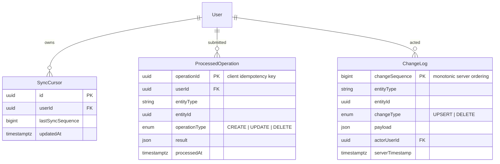
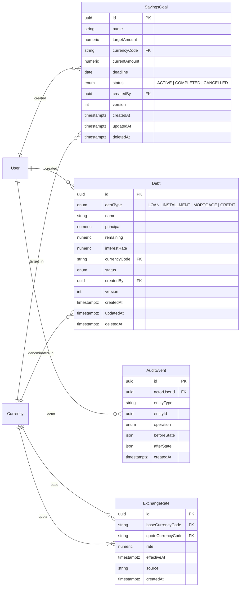

# Balance — Entity-Relationship Diagram

Data model derived from [`SPEC.md`](./SPEC.md). Agent rules: [`AGENTS.md`](../../AGENTS.md).

**Context:** one financial space (no `Space` / tenant entity); accounts are **not** owned by users; attribution lives on operations (`createdBy`).

---

## 1. MVP — core domain

```mermaid
erDiagram
    direction LR

    User ||--o| UserPreferences : has
    User }o--|| Currency : "defaultCurrency"
    User ||--o{ Account : created
    User ||--o{ Category : created
    User ||--o{ Transaction : createdBy
    User ||--o{ Transaction : updatedBy

    Currency ||--o{ Account : denominated_in
    Currency ||--o{ Transaction : amount_in

    Account ||--o{ Transaction : posts_to
    Category ||--o{ Transaction : classifies
    TransferGroup ||--|{ Transaction : links_legs

    User {
        uuid id PK
        string email UK
        string passwordHash
        string displayName
        string defaultCurrencyCode FK
        timestamptz createdAt
        timestamptz updatedAt
    }

    UserPreferences {
        uuid userId PK_FK
        enum locale "en | ru"
        enum theme "light | dark | system"
        int version
        timestamptz updatedAt
    }

    Currency {
        string code PK "RUB USD EUR ..."
        string name
        int decimalPlaces
        string symbol
    }

    Account {
        uuid id PK
        string name
        string currencyCode FK
        numeric initialBalance
        int version
        uuid createdBy FK
        timestamptz createdAt
        timestamptz updatedAt
        timestamptz deletedAt
    }

    Category {
        uuid id PK
        enum type "INCOME | EXPENSE"
        string name
        int version
        uuid createdBy FK
        timestamptz createdAt
        timestamptz updatedAt
        timestamptz deletedAt
    }

    TransferGroup {
        uuid id PK
        timestamptz createdAt
    }

    Transaction {
        uuid id PK
        enum type "INCOME | EXPENSE | TRANSFER_OUT | TRANSFER_IN"
        uuid accountId FK
        uuid categoryId FK "nullable for transfers"
        uuid transferGroupId FK "required for transfer legs"
        numeric amount
        string currencyCode FK
        date transactionDate
        string description
        uuid createdBy FK
        uuid updatedBy FK
        int version
        timestamptz createdAt
        timestamptz updatedAt
        timestamptz deletedAt
        timestamptz clientTimestamp
        timestamptz serverTimestamp
    }
```

### Transfer model

A transfer is **two linked rows** in `Transaction` sharing `transferGroupId`:

```text
Account A (USD)  --TRANSFER_OUT-->  transferGroupId = X
Account B (USD)  --TRANSFER_IN-->   transferGroupId = X
```

Creating a transfer must run in a **single PostgreSQL transaction** (SPEC §41): both legs are atomic.

`categoryId` is `NULL` for transfer legs. Amounts are always positive; direction is encoded in `type`.

---

## 2. MVP — sync and idempotency



| Entity | Storage | Purpose |
| --- | --- | --- |
| `SyncCursor` | PostgreSQL (+ client cache) | Pull: all changes after sequence N |
| `ProcessedOperation` | PostgreSQL | Idempotency: duplicate `operationId` is not applied twice |
| `ChangeLog` | PostgreSQL | Change feed for pull sync |
| `PendingMutation` | **IndexedDB only** (not PG) | Client offline mutation queue |

Shared sync fields on syncable entities (`Account`, `Category`, `Transaction`): `version`, `deletedAt`, `createdAt`, `updatedAt`, `clientTimestamp`, `serverTimestamp`.

---

## 3. Post-MVP — extensions (add when each feature is built)



Do **not** create Post-MVP tables during MVP: `SavingsGoal`, `ExchangeRate`, `Debt`, `AuditEvent`, or `Space` / `AccountMember` (SPEC §9).

---

## 4. Cardinalities and constraints

| Relationship | Cardinality | Notes |
| --- | --- | --- |
| User ↔ UserPreferences | 1:1 | `userId` is PK/FK |
| User → Transaction | 1:N | `createdBy` is attribution, not account ownership |
| Account → Transaction | 1:N | Balance is derived from account operations |
| Category → Transaction | 1:N | INCOME/EXPENSE only; transfers have `categoryId = NULL` |
| TransferGroup → Transaction | 1:2 | Exactly two legs per transfer |
| Currency → Account | 1:N | Account currency is explicit, not from `User.defaultCurrency` |

---

## 5. Recommended indexes (SPEC §40)

```text
Transaction:        accountId, categoryId, createdBy, transactionDate, deletedAt
Account:            deletedAt, currencyCode
Category:           type, deletedAt
ChangeLog:          changeSequence (PK), entityType + entityId
ProcessedOperation: operationId (PK), userId + processedAt
```

---

## 6. Intentionally excluded

| Item | Reason |
| --- | --- |
| Budget / spending limits | Out of scope (SPEC §1) |
| Space / Tenant / AccountMember | Not MVP (SPEC §9) |
| `PendingMutation` in PostgreSQL | Client queue lives in IndexedDB (SPEC §23–24) |
| Event Sourcing | Not required; prefer state + change log (SPEC §60) |
